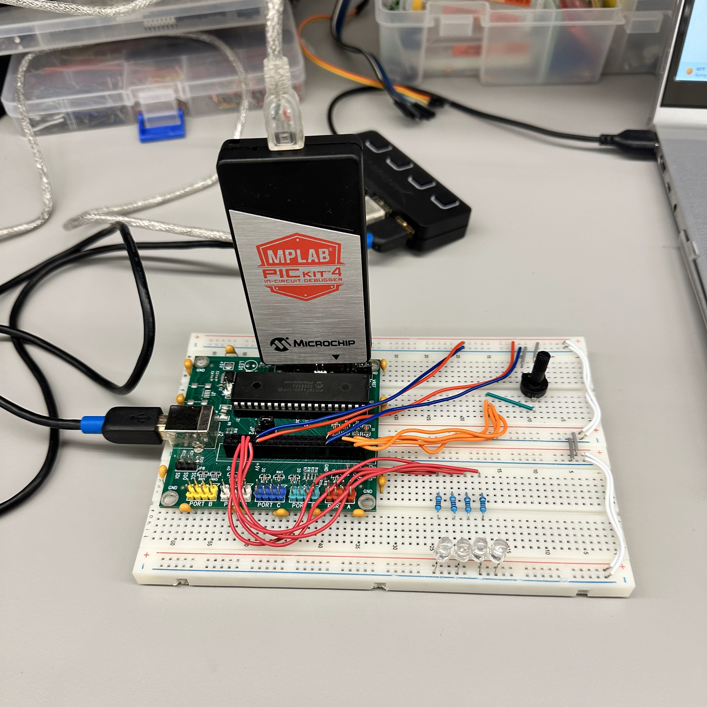
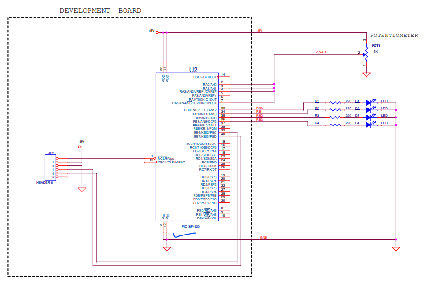

# ADC Initialization and LED Flashing - Saif Alomari

Part 1: ADC Initialization and LED Flashing

This part of the lab involves initializing the Analog-to-Digital Converter (ADC) and using it to measure an analog signal on channel AN0. The measured value is then used to control the flashing pattern of an LED connected to PORTB. The LED flashing delay is directly proportional to the ADC value, demonstrating how to read analog inputs and use them to control digital outputs.

Part 2: UART Initialization and Floating-Point Printing

The second part focuses on initializing the UART for serial communication. It sets up the UART module, allowing the microcontroller to send and receive data over a serial interface. The code continuously prints formatted floating-point values via the UART, showcasing how to configure and use UART for transmitting data, and how to format and print floating-point numbers.

Part 3: ADC Voltage Reading and UART Communication

In the final part, the lab combines ADC and UART functionalities. It reads analog voltages from multiple ADC channels (AN0 to AN4) and converts the ADC values to corresponding voltages. These voltage values are then printed via the UART. This part demonstrates the integration of ADC for analog input measurement and UART for data communication, highlighting the practical application of reading sensor values and transmitting them to a host system for monitoring or further processing.

The circuit: 

The schematics: 

