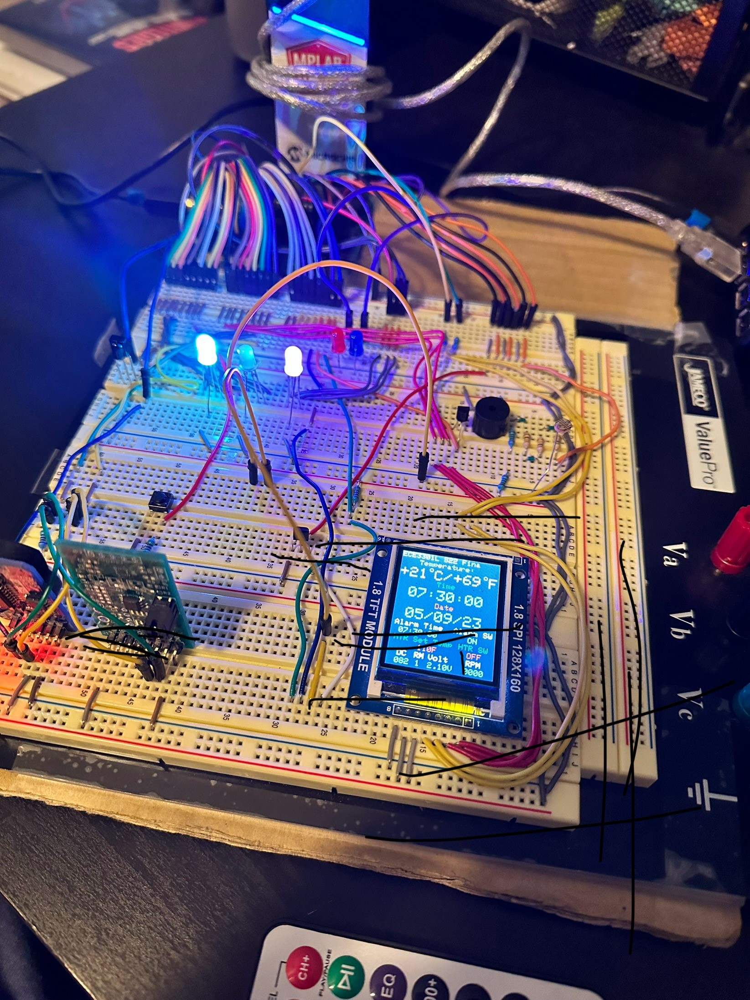
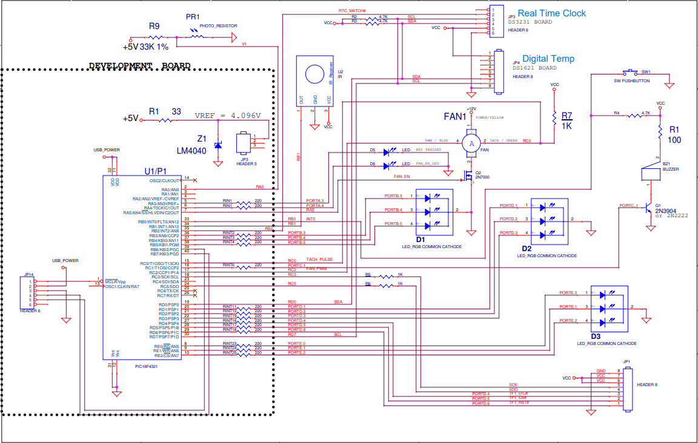

# Final Project Real Time Clock, Alarm System, and Heater System - Saif Alomari

This final project focuses on implementing a real-time clock, alarm system, and heater control system using a PIC18F4620 microcontroller. 
It integrates various functionalities such as interfacing with an LCD screen, handling IR remote control input, measuring 
temperature via I2C, and controlling a heater system. The lab provides practical experience with real-time control and monitoring
of hardware components in an embedded system, highlighting the integration of multiple peripherals and communication protocols.

Main Loop:
- Time and Temperature Update: Reads the current time and temperature every second, updates the LCD display, and calculates RPM (revolutions per minute) of the fan.
- IR Remote Control Handling: Checks for IR remote control input, identifies the button pressed, and performs corresponding actions such as setting the time, controlling the fan, and updating the display.
- Alarm Handling: Manages the alarm system by checking if the current time matches the alarm time and triggering the alarm.
- Fan Control: Adjusts the fan speed based on the temperature difference between the set temperature and the actual temperature.

Subroutines and Functions:
- putch: UART function to send a character.
- init_UART: Initializes UART settings.
- Initialize_Screen: Initializes the LCD screen and displays the initial text.
- Wait Functions: Provides functions for delays.
- Buzzer Control: Functions to activate and deactivate the buzzer.
- Alarm Functions: Functions to manage the alarm system, including enabling/disabling the alarm and handling alarm matches.

The circuit: 

The schematics: 

