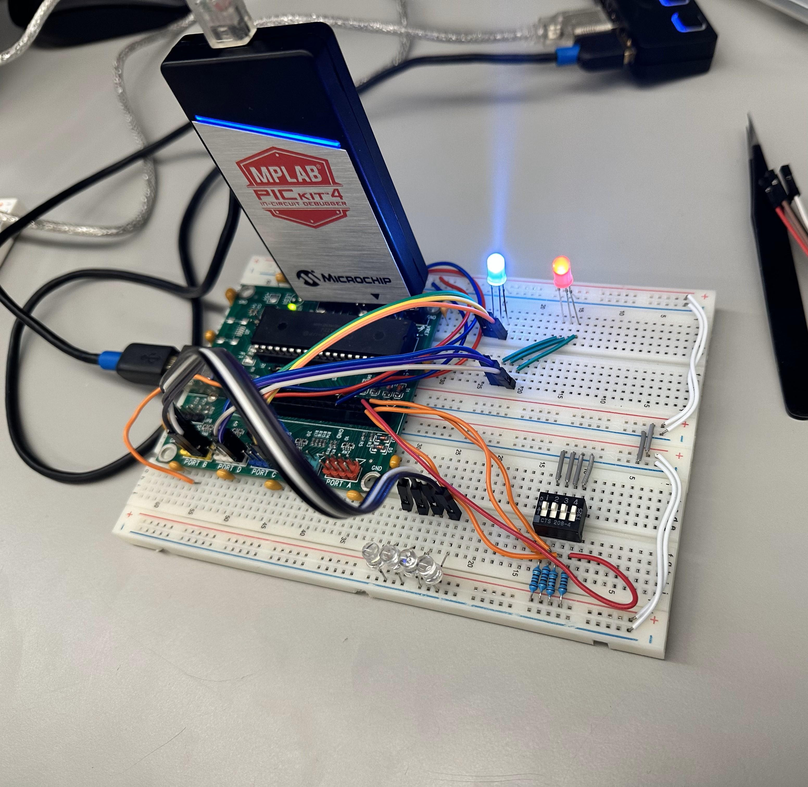
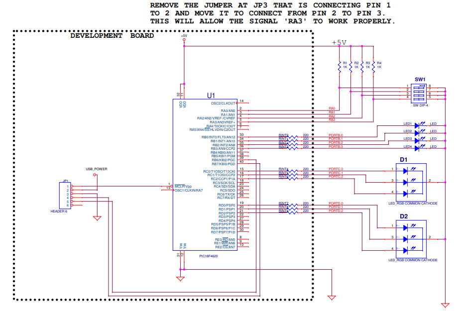

# Microcontroller IO Port Configuration and RGB LED Control - Saif Alomari

Part 1: Basic I/O Port Operation

This part of the lab involves configuring PORTA as an input port and PORTB as an output port on the PIC18F4620 microcontroller. 
The code reads the input from PORTA, masks the upper four bits, and outputs the lower four bits to PORTB. This demonstrates 
basic digital I/O operations, where the microcontroller reads digital signals and controls output based on the input.

Part 2: RGB LED Control

In the second part, the lab extends the I/O operation to control an RGB LED connected to PORTC. PORTA is configured as input, 
and PORTC is configured as output. The code reads input from PORTA and masks the upper four bits. The lower four bits are then 
used to control the RGB LED connected to PORTC. This part demonstrates how to interface and control an RGB LED using a 
microcontroller by reading digital input and setting output accordingly.

Part 3: RGB LED Sequence Control

This part involves creating a specific sequence to control the RGB LED using PORTC and PORTD. An array is used to define 
a sequence for the LED to follow. The code continuously loops through this sequence, setting the outputs on PORTC and PORTD to 
control the LED colors. A delay function is used to create a visible effect. This demonstrates more advanced control of the RGB 
LED, showing how to implement and control sequences using arrays and loops in embedded programming.

Part 4: Integrated RGB LED Control with Delay

The final part integrates the previous concepts to control the RGB LED with both PORTC and PORTD. The code uses an array to 
specify a sequence for the RGB LED colors and a delay function to make the changes visible. The LED connected to PORTC cycles 
through a straightforward sequence, while the LED connected to PORTD follows a specific pattern defined in the array. This 
part highlights the use of delay functions and advanced control techniques for RGB LEDs in embedded systems.

The circuit: 

The schematics: 

