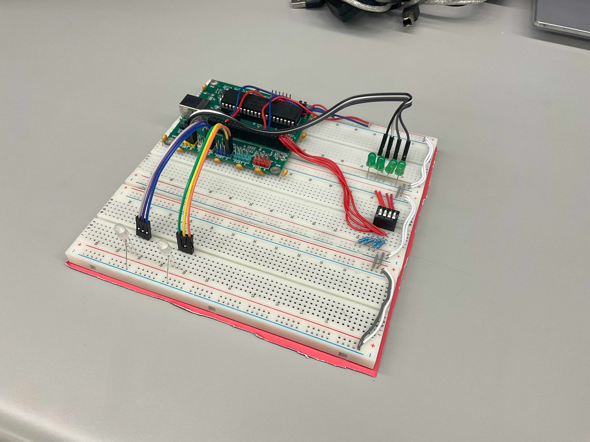

# Assembly Programming for LED Control - Saif Alomari

This lab focuses on using assembly language to program the PIC18F4620 microcontroller for controlling LED sequences. 
It demonstrates key concepts such as configuring I/O ports, using pointers for array manipulation, implementing delay 
routines, and controlling loops in assembly. The code showcases the low-level control and timing precision achievable 
with assembly programming for embedded systems.

Detailed Breakdown:

Configuration and Setup:

- Configuration Settings: The code configures the microcontroller settings such as internal oscillator, watchdog timer off, low-voltage programming off, and brown-out reset off.
Constant Declarations: Defines constants for delay values, counters, color values, and loop counts.
Memory Allocation: Assigns specific memory addresses to constants that will be used for storing LED sequences.

- Initialization:
ADCON1 Configuration: Configures the analog-to-digital converter.
Port Setup: Sets PORTC and PORTD as output ports.
Array Initialization: Loads predefined LED sequences into memory locations starting at D1_Start_Value and D2_Start_Value.

- Main Loop (WHILE_LOOP):

Setup Pointers: Uses the LFSR instruction to set pointers to the start of the LED arrays.
Color Value and Loop Count: Initializes the Color_Value and Loop_Count variables.

- For Loop (FOR_LOOP):

LED Value Output: Reads values from the arrays using the INDF register and outputs them to PORTC and PORTD.
Delay Function: Calls a delay subroutine to pause for one second.
Pointer Increment: Increments pointers to move to the next array elements.
Loop Control: Increments Color_Value and decrements Loop_Count to control the loop iteration.

- Delay Subroutine (DELAY_ONE_SEC):

Nested Loops: Uses nested loops to create a delay of approximately one second by counting down Counter_H and Counter_L.

- Infinite Loop: The WHILE_LOOP ensures that the LED sequence continuously cycles.

The circuit: 

