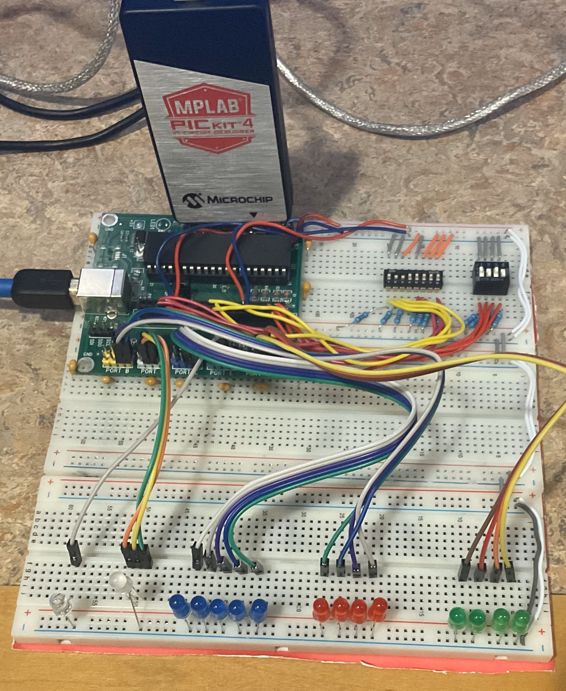
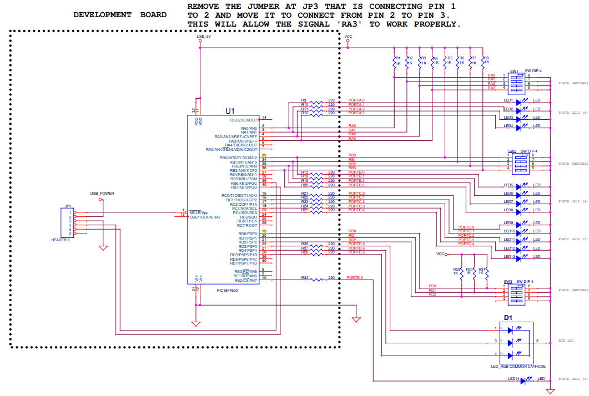

# Assembly Programming with Task Selection Control - Saif Alomari

This assembly code is written for the PIC18F4620 microcontroller and integrates various tasks controlled by 
input signals on PORTD. Depending on the configuration of bits on PORTD, the code executes different operations 
(Complement, Addition, XOR, OR, and BCD) on input data from PORTA and PORTB. The results are displayed on PORTC, 
and specific LEDs are controlled based on the executed task.

Detailed Breakdown:

- Configuration and Setup:
Configuration Settings: The code configures the microcontroller settings such as internal oscillator, watchdog timer off, low-voltage programming off, and brown-out reset off.
Constant Declarations: Defines memory locations for input variables (InA, InB), results, and other control values.

- Initialization:
Port Configuration: Sets PORTA and PORTB as input ports, PORTC and PORTE as output ports, and configures PORTD as a mix of input and output.
ADCON1 Configuration: Configures the analog-to-digital converter.

- Main Loop (MAIN_LOOP):
  - Control Signal Check: Uses bit test instructions (BTFSC) to check specific bits on PORTD and determine which task to execute based on the configuration of bits 0, 1, and 2 on PORTD.
  - Task Selection:
      - D2 = 1: Executes TASK_BCD (Binary-Coded Decimal).
      - D2 = 0 and D1 = 1: Further checks D0 to decide between TASK_OR and TASK_XOR.
      - D2 = 0 and D1 = 0: Further checks D0 to decide between TASK_ADD and TASK_COMP.

- Tasks:
  - TASK_COMP: Clears RGB LEDs and calls SUB_COMP for one's complement operation.
  - TASK_ADD: Sets the red LED, clears others, and calls SUB_ADD for addition.
  - TASK_XOR: Sets the green LED, clears others, and calls SUB_XOR for XOR operation.
  - TASK_OR: Sets both green and red LEDs (resulting in yellow), and calls SUB_OR for OR operation.
  - TASK_BCD: Sets the blue LED, clears others, and calls SUB_BCD for binary-coded decimal conversion.

- Subroutines:
  - SUB_COMP: Performs one's complement on InA from PORTA, stores the result in Result, and displays it on PORTC.
  - SUB_ADD: Adds values from PORTA and PORTB, stores the result in Result, and displays it on PORTC.
  - SUB_XOR: Performs XOR operation on values from PORTA and PORTB, stores the result in Result, and displays it on PORTC.
  - SUB_OR: Performs OR operation on values from PORTA and PORTB, stores the result in Result, and displays it on PORTC.
  - SUB_BCD: Converts the value from PORTA to binary-coded decimal and displays it on PORTC.

- Zero Flag Check: Each subroutine checks if the result is zero using the Zero flag and sets or clears bit 0 of PORTE accordingly.

The circuit: 

The schematics: 

