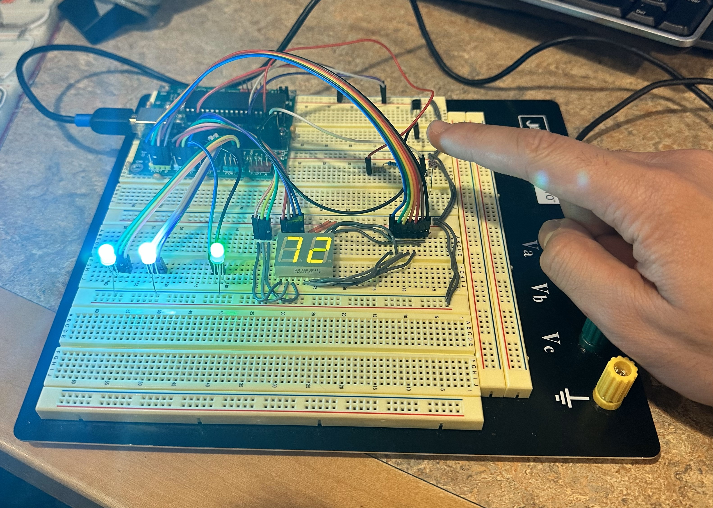

# Temperature and Light Sensors Control

In this Project, a system was made to monitor temperature and light levels using sensors. It initializes various peripherals, including analog-to-digital conversion (ADC), universal asynchronous receiver-transmitter (UART), and defines functions to control RGB lights and display temperature and light levels. Within the main loop, it reads temperature from an LM84 sensor and converts it to Fahrenheit, displays it on a 7-segment display, and adjusts the color of an RGB LED based on the temperature. It also reads light levels from a sensor, adjusts another RGB LED's color accordingly, and then delays for a second before repeating the process.

- Inputs:
    - LM84 sensor.
    - Photo sensor.
- Outputs:
    - 7 Segments Display.
    - RGB LEDs. 

Final output: 

