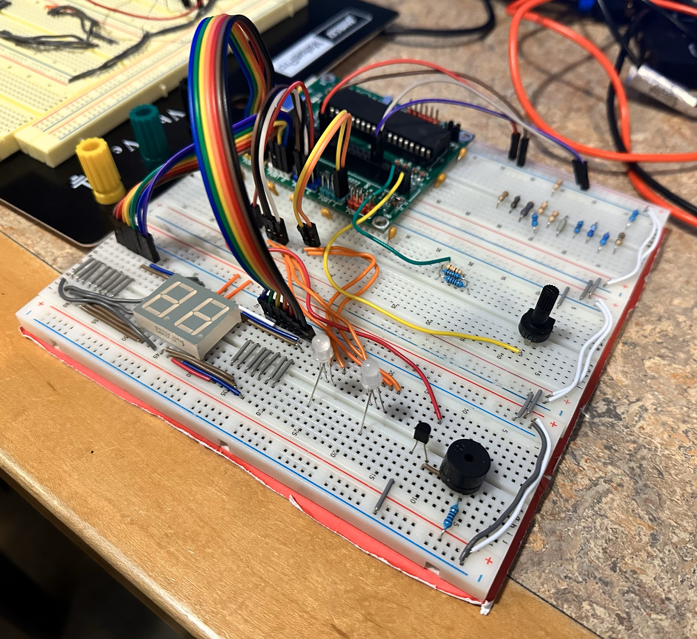

# Digital Voltage Meter and Ohm Meter

In this project, a system was made to measure voltage and resistance using a microcontroller and display the results on a 7-segment display, control RGB lights based on the resistance value, and activate a buzzer for low resistance values. The system employs analog-to-digital conversion (ADC) to measure voltage and calculate resistance using a known reference resistor. The voltage and resistance values are displayed on separate 7-segment displays, with the resistance value determining the color of two sets of RGB lights. Additionally, a buzzer is activated when the resistance drops below a certain threshold.

- Inputs:
    - Voltage rotary.
    - Resistors with different values.
- Outputs:
    - 7 Segments Display.
    - RGB LEDs.
    - Buzzer.

Final output: 

