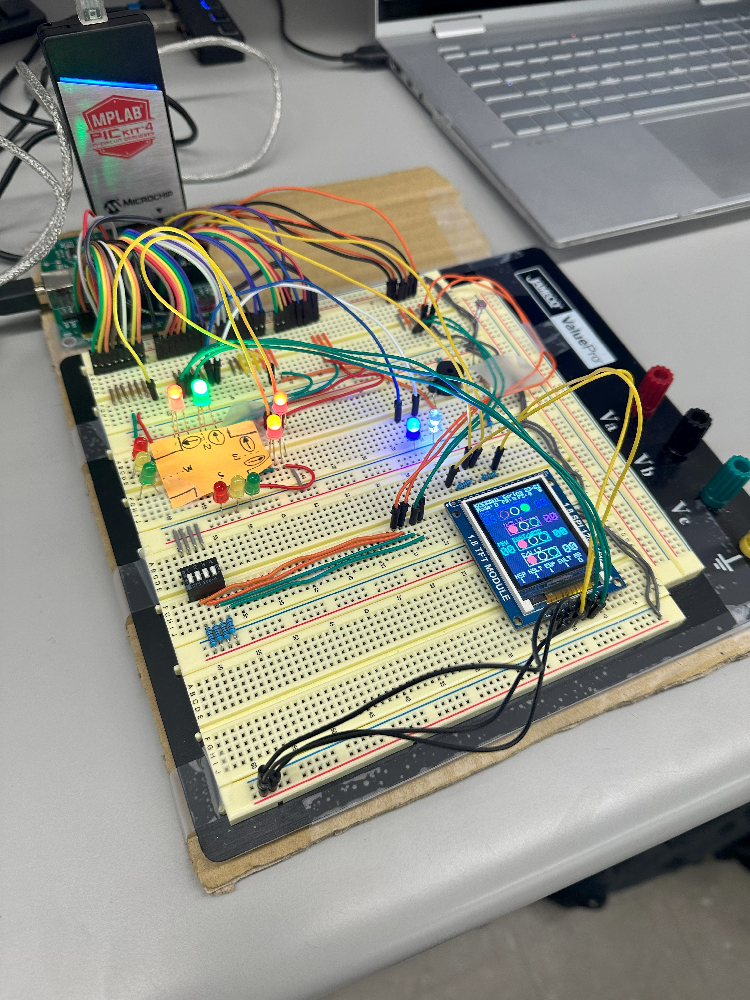

# Traffic Lights Control System 

In this project, a system was made to develop a sophisticated traffic light control system with an integrated LCD display to optimize traffic flow and pedestrian safety. By employing microcontrollers and sensors, the system efficiently manages traffic signals for both East-West and North-South directions, cycling through red, green, and yellow lights. Pedestrian crossings are synchronized with traffic signals to ensure safe passage, while a day-night mode adjusts signal timings based on ambient light levels. The LCD display provides real-time updates on the system's mode, current signal status, pedestrian signals, and emergency requests, enhancing visibility and facilitating effective monitoring.

- Inputs:
    - Switches for pedestrian control.
    - Resistors with different values.
- Outputs:
    - 7 Segments Display.
    - RGB LEDs.
    - Buzzer.

System Design:

Final circuit output: 

