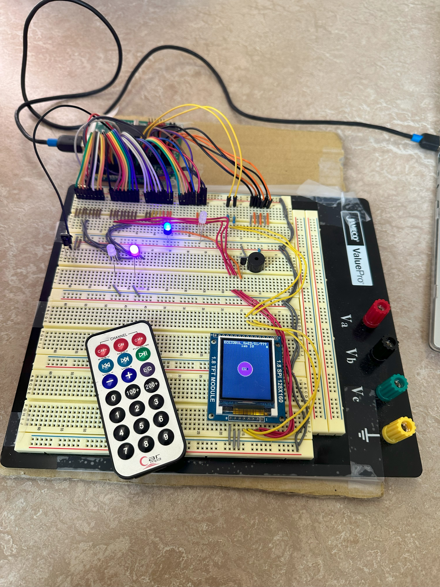

# Infra Red Remote Control using External Interrupts - Saif Alomari

This C code is designed for a PIC18F4620 microcontroller and interfaces with an Infra-Red (IR) remote control 
using external interrupts. The lab demonstrates how to use external interrupts to detect IR signals, process 
them, and control an LCD screen and RGB LEDs based on the received IR commands.

The circuit: 

The IR Remote interface: 

The schematics: 

