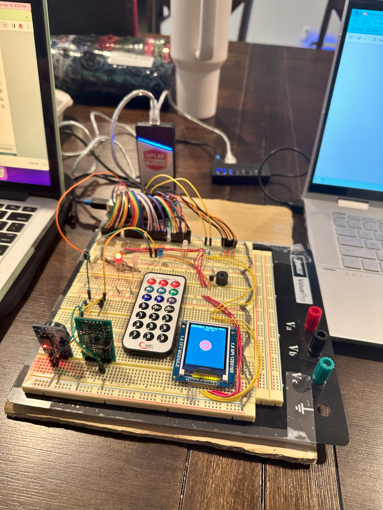
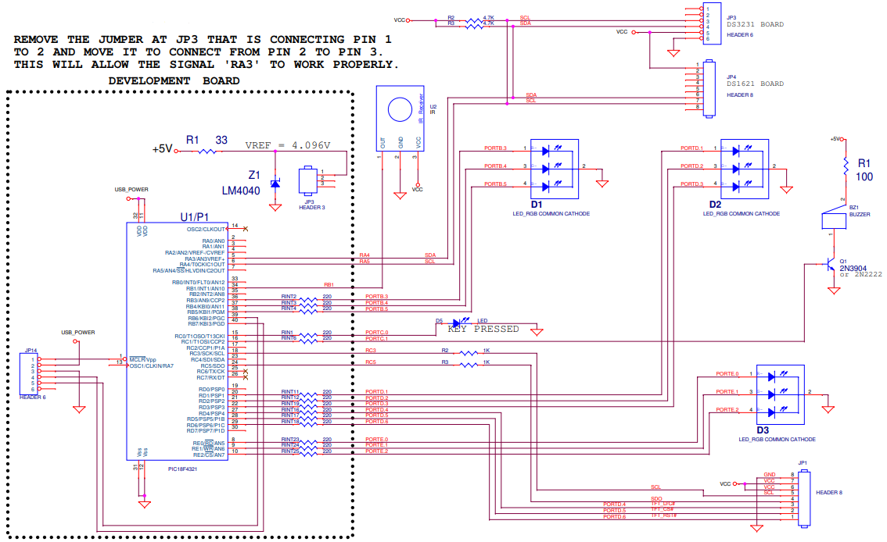

# I2C Bus Implementation - Saif Alomari

This project focuses on implementing I2C communication and handling external interrupts on a PIC18F4620 microcontroller. 
It demonstrates how to initialize and use the I2C protocol for data exchange and configure external interrupts for
event-driven processing. The lab provides practical experience in setting up and using I2C communication, writing 
support functions for I2C operations, and handling interrupts to create a responsive embedded system.

Detailed Breakdown:

- I2C Communication:
  - I2C Initialization: Configures the I2C pins for communication.
  - I2C Start and Stop Conditions: Implements the start and stop conditions for I2C communication.
  - I2C Data Transmission: Provides functions to write and read data over the I2C bus.
  - I2C Support Functions: Additional functions for writing to an I2C address and reading data from an I2C device.

- Interrupt Handling:
  - Interrupt Initialization: Configures the external interrupt settings.
  - High Priority Interrupt Service Routine (chkisr): Checks and handles the INT1 interrupt.
  - INT1_isr: The ISR function that is triggered by the INT1 interrupt.

- Main Loop:
  - I2C and Interrupt Initialization: Initializes the I2C communication and interrupt settings.
  - Continuous Operation: Runs an infinite loop to keep the microcontroller operational and ready to handle interrupts.

The circuit: 

The schematics: 

